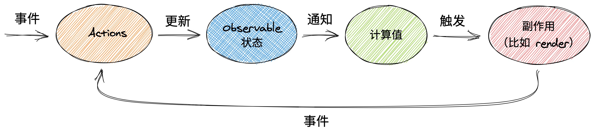

## 介绍

MobX 是一个身经百战的库，它通过运用透明的函数式响应编程（Transparent Functional Reactive Programming，TFRP）使状态管理变得简单和可扩展。具有如下特点

- 简单直接：编写无模板的极简代码来精准描述出你的意图。要更新一个记录字段。使用熟悉的 JavaScript 赋值就行。要在异步进程中更新数据？不需要特殊的工具，响应性系统会侦测到你所有的变更并把它们传送到其用武之地
- 轻松实现最优渲染：所有对数据的变更和使用都会在运行时被追踪到，并构成一个截取所有状态和输出之间关系的依赖树。这样保证了那些依赖于状态的计算只有在真正需要时才会运行，就像 React 组件一样。无需使用记忆化或选择器之类容易出错的次优技巧来对组件进行手动优化
- 架构自由：MobX 不会用它自己的规则来限制你，它可以让你在任意 UI 框架之外管理你的应用状态。这样会使你的代码低耦合、可移植和最重要的 —— 容易测试

MobX 没有 Redux 和 Vuex 那么多概念，样板代码的数量很小，代码可读性和可维护性高

## 设计哲学

MobX 区分应用程序中的三个概念，State(状态)、Actions(动作)和 Derivations(派生)三个重要概念

用户通过事件 dispatch Action,更新被观察的 State，进而更新 Derivations 状态，最后触发页面渲染



## 快速开始

### 创建 store

```ts
// Counter.ts

class Counter {
  count = 0;

  constructor() {
    makeAutoObservable(this);
  }

  setCount = (count: number): void => {
    this.count += count;
  };

  reset = (): void => {
    this.count = 0;
  };
}

export default new Counter();
```

### 从根组件注入 stores

从 App 组件中注入 stores

```tsx
// App.tsx

import ReactDOM from "react-dom/client";
import App from "./App.tsx";
import { Provider } from "mobx-react";

import stores from "./stores/counter.ts";

const rootEl = document.getElementById("root") as HTMLElement;

ReactDOM.createRoot(rootEl).render(
  <Provider stores={stores}>
    <App />
  </Provider>
);
```

### 在组件中使用 stores

- 使用 observer

```tsx
// Example.tsx

import type { ReactElement } from "react";
import { observer, useLocalObservable } from "mobx-react";

import stores from "../stores/counter.ts";

const Example = observer((): ReactElement => {
  const { setCount } = useLocalObservable(() => stores);

  return <button onClick={(): void => setCount(1)}>add</button>;
});

export default Example;
```

- 使用 useObserver

```tsx
// Example.tsx

import type { ReactElement } from "react";
import { useObserver, useLocalObservable } from "mobx-react";

import stores from "../stores/counter.ts";

const Example = (): ReactElement => {
  const localStore = useLocalObservable(() => stores);

  return useObserver(() => <button onClick={(): void => localStore.setCount(1)}>add</button>);
};

export default Example;
```

- 使用 Observer

```tsx
// Example.tsx

import type { ReactElement } from "react";
import { Observer, useLocalObservable } from "mobx-react";

import stores from "../stores/counter.ts";

const Example = (): ReactElement => {
  const localStore = useLocalObservable(() => stores);

  return <Observer>(() => <button onClick={(): void => localStore.setCount(1)}>add</button></Observer>;
};

export default Example;
```

## 进阶

## 参考链接

- [MobX](https://zh.mobx.js.org/README.html)
