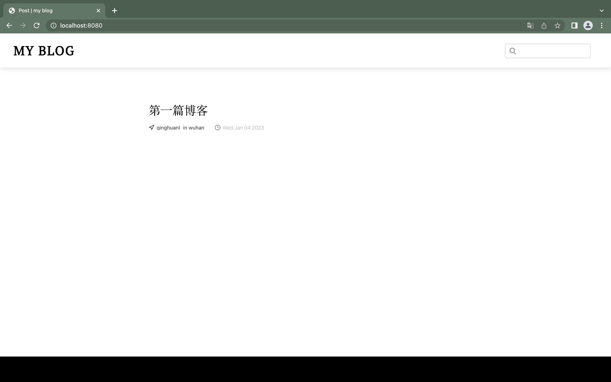

作为一名技术人员，搭建自己的技术博客，有助于总结和沉淀知识，建设技术影响力，扩宽职业发展

市面上有非常多的博客搭建工具，比如大名鼎鼎的 WordPress，也有新晋的 Hexo 等等，但是本文向大家传授使用 VuePress 搭建个人技术博客

## VuePress

vuePress 是 vue 为驱动的一个静态网站生成工具，可以用它来编写技术文档和搭建个人博客。它的有下列特性：

- 内置 markdown 扩展，针对技术文档进行了优化
- 可以直接在 markdown 文件中使用 Vue 代码
- 包含一个默认主题，也可通过 vue 代码编写自定义主题
- 支持 PWA
- Google Analytics 集成

### 安装 VuePress

> VuePress 需要 Node.js (opens new window)>= 8.6

在本地创建一个博客项目

```shell
mkdir blog
```

然后使用你喜欢的包管理器进行初始化，笔者在这里使用 `npm`

```shell
npm init # or yarn init
```

将 VuePress 安装为本地依赖

```shell
npm install -D vuepress #yarn add -D vuepress
```

在 package.json 中添加一些 scripts

```json
{
  "scripts": {
    "docs:dev": "vuepress dev docs",
    "docs:build": "vuepress build docs"
  }
}
```

### 添加主题

将官方的博客主题添加到我们的项目中

```shell
npm install vuepress @vuepress/theme-blog -D
# or yarn add vuepress @vuepress/theme-blog -D
```

推荐的文件目录如下

```text
├── blog
│   ├── _posts
│   │   ├── 第一篇博客.md #example
│   │   └── 第二篇博客.md #example
│   └── .vuepress
│       ├── `components` _(**Optional**)_
│       ├── `public` _(**Optional**)_
│       ├── `styles` _(**Optional**)_
│       │   ├── index.styl
│       │   └── palette.styl
│       ├── config.js
│       └── `enhanceApp.js` _(**Optional**)_
└── package.json
```

### 博客配置

下面是博客的配置说明

```js
module.exports = {
  // 博客标题
  title: "my blog",
  // 主题设置
  theme: "@vuepress/theme-blog",
};
```

### 添加文章

在 blog 目录下新建一个 docs 文件夹，在 docs 文件夹里创建 \_post 文件夹，并在创建**第一篇博客.md**，如下所示

```md
---
title: 第一篇博客
date: 2023-01-04
author: qinghuanI
location: wuhan
---

第一篇博客内容
```

在本地启动服务器

```shell
npm run docs:dev # or yarn docs:dev
```

VuePress 会在 [http://localhost:8080](http://localhost:8080/) 启动一个热重载的开发服务器。页面效果如下所示



### 部署

笔者将代码托管在 GitHub,下面使用 Github Pages 进行部署个人博客

在自己的 github 创建一个 githubName.github.io 名称的仓库。比如我的 github 名称是 qinghuanI,那么我创建的仓库名是 qinghuanI.github.io。然后提交所有代码

然后在项目根目录下的 `.github/workflows` 目录（没有的话，请手动创建一个）下创建一个 .yml 或者 .yaml 文件，如:blog-deploy.yml;

```textmate
name: Build and Deploy
on: [push]
jobs:
  build-and-deploy:
    runs-on: ubuntu-latest
    steps:
      - name: Checkout
        uses: actions/checkout@master

      - name: blog-deploy
        uses: jenkey2011/vuepress-deploy@master
        env:
          ACCESS_TOKEN: ${{ secrets.BLOG }}
          TARGET_REPO: qinghuanI/qinghuanI.github.io <--- 你的仓库名
          TARGET_BRANCH: gh_pages
          BUILD_SCRIPT: yarn && yarn run build
          BUILD_DIR: blog/.vuepress/dist
          CNAME: https://www.qinghuani.fun
```

配置仓库的 `ACCESS_TOKEN` 后，当代码构建完成后，就可以从 https://qinghuanI.github.io 访问了

### 自定义域名

如果您需要自定义网站的域名，可以去阿里云或腾讯云购买域名，然后进行如下的配置

```textmate
 env:
   ACCESS_TOKEN: ${{ secrets.BLOG }}
   TARGET_REPO: qinghuanI/qinghuanI.github.io <--- your repo name
   TARGET_BRANCH: gh_pages
   BUILD_SCRIPT: yarn && yarn run build
   BUILD_DIR: blog/.vuepress/dist
   CNAME: https://www.qinghuani.fun  <--- 你购买的域名
```

## 参考链接

- [@vuepress/theme-blog](https://vuepress-theme-blog.billyyyyy3320.com/#intro)
