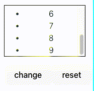
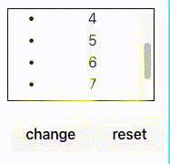

## 背景

最近一段时间在解决公司项目中的技术债(修复各种 bug)，遇到一个与 React List 有关的有趣的问题

该项目是一个客服呼叫中心平台，使用 React 框架开发的后台管理系统。其侧边栏是一个会话列表（会话比较多，有纵向滚动条）并且列表按照一定的规则排序，当客服选择列表最后一个会话并向客户发送消息后，该会话会排序到列表的第一个但是滚动条却发生了滚动

## 问题简化分析

笔者使用简单的 React List 组件来描述项目中的问题，代码如下

```tsx
// List.tsx

import { useEffect, useRef, useState } from "react";
import { createUseStyles } from "react-jss";

type RuleNames = "wrapper";

const useStyles = createUseStyles<RuleNames>({
  wrapper: {
    width: "120px",
    height: "100px",
    border: "1px solid #000",
    overflowY: "auto",
    overflowX: "hidden",
  },
});

const num1 = [1, 2, 3, 4, 5, 6, 7, 8, 9];
const num2 = [9, 2, 3, 4, 5, 6, 7, 8, 1];

export default function List(): React.ReactElement {
  const [nums, setNums] = useState<number[]>(num1);
  const classes = useStyles();

  const onNumChange = (): void => {
    setNums(num2);
  };

  const onReset = (): void => {
    setNums(num1);
  };

  return (
    <>
      <ul className={classes.wrapper}>
        {nums.map((num) => (
          <li key={num}>{num}</li>
        ))}
      </ul>
      <button onClick={onNumChange}>变更数据位置</button>
      <button onClick={onReset}>reset</button>
    </>
  );
}
```

如代码所示，`List` 是一个渲染`1-9`的组件，由于 ul 的高度限制，`List` 组件有纵向滚动条没有横向滚动条，
将滚动条滑动到元素底部，点击**change**按钮，数字 `9` 会从列表最后一项变更到第一项，此时滚动条滚动到元素顶部



当列表的第一项和最后一项都不在视图里时，将列表最后一项变更到第一项，此时滚动条不会发生滚动



而期望结果是希望滚动条不发生滚动

## 原因分析

## 解决方案

```jsx
// List.jsx

import { useRef } from "react";

const nums = [1, 2, 3];

const List = () => {
  const ulRef = useRef(null);
  const scrollHeight = useRef(0);

  useEffect(() => {}, []);

  return (
    <ul>
      {nums.map((num) => (
        <li key={num}>{num}</li>
      ))}
    </ul>
  );
};
```

## 参考链接
