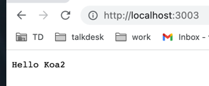
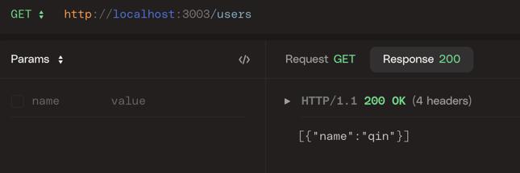

## 背景

Node.js 是一个 JavaScript 运行时，它让 JavaScript 脱离了浏览器环境，可以直接在计算机上运行，如同 Python、Java、Ruby 等其它编程语言，极大地拓展了 JavaScript 用途

随着 Node.js 不断的发展，社区涌现出很多 Node.js 的 web 框架。

Koa 是一个新的 web 框架，由 Express 幕后的原班人马打造， 致力于成为 web 应用和 API 开发领域中的一个更小、更富有表现力、更健壮的基石。 通过利用 async 函数，Koa 帮你丢弃回调函数，并有力地增强错误处理。 Koa 并没有捆绑任何中间件， 而是提供了一套优雅的方法，帮助您快速而愉快地编写服务端应用程序

本篇文章使用 Koa2 实现 Restful 服务

## 快速开始

在本地创建一个 koa2-service 项目

```shell
mkdir koa2-service && cd koa2-service
```

初始化 koa2-service 项目，添加 package.json 文件

```shell
yarn init
```

根据提示，一步步填写项目信息

安装 koa2 依赖

```shell
yarn add koa2
```

创建 `main.js` 文件

```js
// main.js

import Koa from "koa";

const app = new Koa();

app.use(async (ctx) => {
  ctx.body = "Hello Koa2";
});

app.listen(3003, () => {
  console.log(`koa2 service is running at localhost:3003`);
});
```

结果如下



这是一个简单的接口响应，类型是 text/plain，接下来将其改为 restful 风格

## 后端路由

在 web 开发早期的年代里，前端的功能远不如现在这么强大，一直是后端路由占据主导地位。无论是 jsp，还是 php、asp，用户能通过 URL 访问到的页面，大多是通过后端路由匹配之后再返回给浏览器的。浏览器在地址栏中切换不同的 URL 时，每次都向后台服务器发出请求，服务器响应请求，在后台拼接 html 文件返回给前端，并且每次切换页面时，浏览器都会刷新页面

在项目中安装路由中间件

```shell
yarn add @koa/router
```

现在实现一个简单的 `/user` GET 接口

```js
// main.js

import Koa from "koa";
import { HOST, PORT } from "./constants.js";
import { router } from "./routers/index.js";

const app = new Koa();

app.use(router.routes()).use(router.allowedMethods());

app.listen(PORT, () => {
  console.log(`koa2 service is running at ${HOST}:${PORT}`);
});
```

router.js 如下

```js
import Router from "@koa/router";
import { fetchUsers } from "../services/users.js";

export const router = new Router();

router.get("/users", fetchUsers);
```

使用 HTTPie 工具调试下实现的 `/users` 接口



但是由于浏览器的同源策略限制，需要处理跨域问题，跨域的解决方式有很多，在这里使用 cors 跨域。在项目中安装 koa-cors 中间件

```shell


```

## api 接口

## 部署
