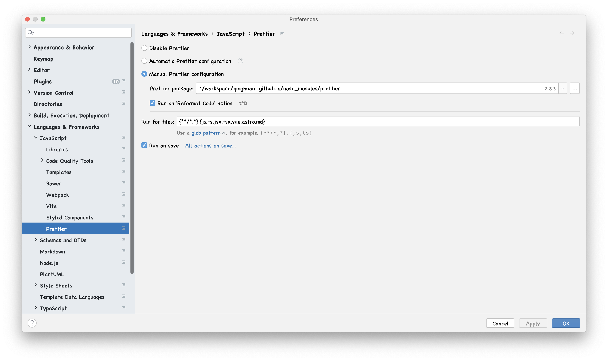

前端工程化是将前端开发流程标准化、规范化、工具化、自动化和简单化。通过各种规范和工具来提高前端应用质量及开发效率

## 配置前端开发环境

优秀地开发环境可以让开发人员专注业务开发，提高开发效率

- [WebStorm](https://www.jetbrains.com/webstorm/) 一款由 JetBrains 开发的强大的 IDE，提供了丰富的功能和智能代码补全，开箱即用
- [Visual Studio Code](https://code.visualstudio.com/)(VS Code) 一个免费、轻量级且功能强大的代码编辑器，拥有丰富地插件生态系统和强大的代码编辑功能
- [Node.js](https://nodejs.org/en) 一个开源、跨平台的 JavaScript 运行时环境，可以编写运行在服务端的 js 应用程序
- [npm](https://docs.npmjs.com/)/[yarn](https://yarnpkg.com/)/[pnpm](https://pnpm.io/) 包管理器
- [Postman](https://www.postman.com/) - 用于接口调试
- [xmind](https://xmind.cn/) - 用来制作思维导图
- [PlantUML](https://plantuml.com/zh/) - 通过纯文本的方式来生成 UML 图
- [iTerm2](https://iterm2.com/)- Mac 上强大的终端工具

## 代码构建和 Lint 工具

### 代码构建工具

由于前端的飞速发展，ECMAScript 快速迭代，而浏览器尚未完全支持新语法，此时需要构建工具将源代码转换成可以在浏览器正常运行的版本。在这个过程中，社区涌现出非常多优秀的工具，主要有下面几个

- [webpack](https://webpack.js.org/)

webpack 是一个用于现代 JavaScript 应用程序的静态模块打包工具。推出时间最早，功能最全，非常强大

- [Rollup](https://rollupjs.org/)

Rollup 是一个 JavaScript 模块打包工具，可以将多个小的代码片段编译为完整的库和应用。与传统的 CommonJS 和 AMD 这一类非标准化的解决方案不同，Rollup 使用的是 ES6 版本 Javascript 中的模块标准。新的 ES 模块可以让你自由、无缝地按需使用你最喜爱的库中那些有用的单个函数。这一特性在未来将随处可用，但 Rollup 让你现在就可以，想用就用

- [Babel](https://babeljs.io/)/

Babel 是一个 JavaScript 编译器

- [esbuild](https://esbuild.github.io/)

esbuild 是一种类似于 webpack 的极速 JavaScript 打包器

- [SWC](https://swc.rs/)

SWC 是一个基于 Rust 的可扩展平台，适用于下一代快速开发工具。SWC 可用于编译和捆绑。对于编译，它使用现代 JavaScript 功能获取 JavaScript / TypeScript 文件，并输出所有主要浏览器支持的有效代码

### [ESLint](https://eslint.org/)

ESLint 静态分析项目代码，快速发现问题并提示修复建议

ESLint 支持开发人员自定义 ESLint 提供的规则。推荐使用自定义配置文件

```js
// eslintrc.js

module.exports = {
  root: true,
  // 环境配置
  env: {},
  parser: "@typescript-eslint/parser",
  parserOptions: {
    ecmaFeatures: {
      jsx: true,
    },
    ecmaVersion: 2020,
    sourceType: "module",
  },
  settings: {
    react: {
      version: "detect",
    },
  },
  extends: ["airbnb", "eslint:recommended"],
  plugins: ["react", "@typescript-eslint", "simple-import-sort", "jest"],
  // 配置 eslint 规则
  rules: {},
};
```

### [Prettier](https://prettier.io/)

Prettier 是一个强约束的代码格式化工具，将原始格式的源代码按照设定的规则进行格式化，然后输出格式化后的代码。支持常见的 `js`、`jsx`、`html`和`.ts` 等等编程语言

Prettier 支持开发人员自定义 Prettier 提供的规则。推荐使用自定义配置文件

```js
// prettier.config.js or .prettierrc.js

module.exports = {
  trailingComma: "es5",
  tabWidth: 2,
  semi: false,
  singleQuote: true,
};
```

在 WebStorm 配置 Prettier 工具。使用 `command+,`快捷键，输入 prettier 搜索，点击 Prettier,打开 Prettier 配置面板



根据项目情况，选择对应的 Prettier 配置，输入需要文件扩展名，勾选 `Run on save`,点击 ok 启用陪配置

### [StyleLint](https://stylelint.io/)

Stylelint 是一个强大、先进的 CSS 代码检查器（linter），可以帮助你规避 CSS 代码中的错误并保持一致的编码风格

### [commitlint](https://commitlint.js.org/#/)

commitlint 是一个 git commit 校验约束工具。就是当我们运行 git commmit -m 'xxx' 时，来检查 'xxx' 是不是满足团队约定好的提交规范的工具

commitlint 检查您的提交消息是否符合常规的提交格式

一般来说，模式大多是这样的：

```text
type(scope?): subject  #scope is optional; multiple scopes are supported (current delimiter options: "/", "\" and ",")
```

根据 commitlint-config-conventional（基于 Angular 约定）的常见类型可以是：

- build：影响构建系统或外部依赖项的更改（示例范围：gulp、broccoli、npm）
- chore：不修改 src 或测试文件的其他更改
- ci：更改我们的 CI 配置文件和脚本（示例范围：Travis、Circle、BrowserStack、SauceLabs）
- docs：文档仅更改
- feat：添加新功能
- fix：错误修复
- perf：提高性能的代码更改
- refactor：既不修复错误也不添加功能的代码更改
- revert：还原以前的提交
- style：不影响代码含义的更改（空格、格式、缺少分号等）
- test：添加缺少的测试或更正现有测试
- release：发布新版本
- workflow：工作流相关的文件修改

## 前端测试

### Jest 单元测试

使用 Jest 搭配其他的工具库可以对 React 组件、react hooks 进行测试

- @testing-library/react 用来测试 React 组件
- @testing-library/react-hooks 用来测试 React hooks

### Playwright 端到端测试

## 团队协作与版本控制

- [GitHub](https://github.com/)/[GitLab](https://about.gitlab.com/) 代码仓库托管，进行代码评审、合并请求，让团队成员之间的协作和代码管理有序进行
- [Jira](https://www.atlassian.com/zh/software/jira) 项目管理工具
- [Slack](https://slack.com/intl/zh-hk/)/[Zoom](https://zoom.us/) 团队协作的沟通工具，促进团队实时交流、讨论和解决问题
- [Confluence](https://id.atlassian.com/login) 文档和知识管理工具，用于记录项目相关信息，分析技术文档和团队共享的知识

## 前端脚手架

- [Vite](https://vitejs.dev/) 一种新型前端构建工具，基于原生 ES 模块能够显著提升前端开发体验
- [Create-React-App](https://create-react-app.dev/) 是一种更简单的方法，它自动为我们完成所有配置和必要的包安装，并在本地启动一个新的 React 应用程序，为开发做好准备
- [UmiJS](https://umijs.org/) 是可扩展的企业级前端应用框架。 Umi 以路由为基础的，同时支持配置式路由和约定式路由，保证路由的功能完备，并以此进行功能扩展。 然后配以生命周期完善的插件体系，覆盖从源码到构建产物的每个生命周期，支持各种功能扩展和业务需求

## UI 组件库

- [Ant Design](https://ant.design/index-cn) 是基于 Ant Design 设计体系的 React UI 组件库，主要用于研发企业级中后台产品

## 前端性能优化

### Lighthouse

用于评估网页性能指标，并提供优化建议和报告。常用 Lighthouse 量化产品的性能指标

### Chrome Devtool

- Element 分析 DOM 结构、调试 css 样式
- Source 前端代码调试
- Performance 分析代码运行情况
- Memory 分析代码运行过程中内存占用情况

### 其他工具

- SWR Chrome 扩展，分析 swr 第三方库的请求状态

## SSR

### Next.js

### Remix

## CI/CD

### CI

持续集成

- GitHub Actions

### CD

持续部署

- GitHub Pages

## 参考链接

- [深入浅出 Webpack](https://webpack.wuhaolin.cn/)
