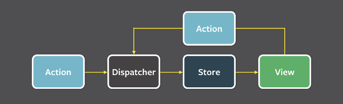

下面是笔者结合自己的工作经验和项目经验总结开发技巧

## 查表法实现动态组件

- 两种情况直接使用三元表达式

两种情况的场景非常简单，一个三元表达式或者 `if...else...` 可以解决，以 Conv-App 项目中的 Contact 与 Channel 模式切换为例子说明

```jsx
const ActiveTab = () => {
  return (
    <>
      {mode === MODE_MAP.contact ? (
        <InteractionListByContact {...interactionListProps} interactionGroups={interactionGroups} />
      ) : null}
      {mode === MODE_MAP.channel ? (
        <InteractionListByChannel {...interactionListProps} interactions={channelInteractions} channels={channels} />
      ) : null}
    </>
  );
};
```

- 只有超过三种（包含三种）情况使用查表法才有意义

以 `webchat-sdk-ui` 项目为例

```tsx
const customComponentMap = {
  field: CustomField,
  dropdown: CustomDropdown,
  button: CustomButton,
  message: CustomMessage,
};

const InitialScreen: FC = (props: Props) => {
  return (
    <>
      {initialScreen?.controls.map((controlItem) => {
        const Component = customComponentMap[controlItem.type];

        return <></>;
      })}
    </>
  );
};
```

## 发布订阅模式

在软件架构中，发布-订阅是一种消息范式，消息的发送者（称为发布者）不会将消息直接发送给特定的接收者（称为订阅者）。而是将发布的消息分为不同的类别，无需了解哪些订阅者（如果有的话）可能存在。同样的，订阅者可以表达对一个或多个类别的兴趣，只接收感兴趣的消息，无需了解哪些发布者（如果有的话）存在

## 一个组件只做一件事

一个组件只做一件事，这样可以让组件清爽。当发现组件越来越大时，我们就需要考虑是否可以将组件拆成多个组件，从而保证我们的每个组件只做一件事，保持组件的简洁和纯粹

## UI 与状态解耦

组件只做两件事，分别是数据展示和用户交互。当 UI 与状态解耦后，整个 React 组件会特别清爽

- 数据展示 - 从接口获取数据，然后正常显示
- 用户交互 - 接收用户交互，通过事件处理

```jsx
const Comp = () => {
  const { data, isLoading, error } = useSWR(key);

  const onChange = () => {
    setXXX();
    service.xxx();
  };

  return (
    <>
      <p>{data}</p>
      <input type="text" onChange={onChange} />
    </>
  );
};
```

## 业务 Hooks 与工具 Hooks

工具 Hooks 是与业务无关。这样的 Hooks 有很多，比如有项目中经常使用 `useClickAway` 检测特定组件之外的点击

```jsx
import { useEffect, useRef } from "react";

function useClickAway(cb) {
  const ref = useRef(null);
  const refCb = useRef(cb);

  useEffect(() => {
    const handler = (e) => {
      const element = ref.current;
      if (element && !element.contains(e.target)) {
        refCb.current(e);
      }
    };

    document.addEventListener("mousedown", handler);
    document.addEventListener("touchstart", handler);

    return () => {
      document.removeEventListener("mousedown", handler);
      document.removeEventListener("touchstart", handler);
    };
  }, []);

  return ref;
}

export default useClickAway;
```

`useClickAway` 与业务没有关系，它可以在任何需要它的使用场景中使用

与工具 Hooks 相对的就是 业务 Hooks, 既然是业务 Hooks 肯定与业务高耦合

## 与 IO 相关的错误处理

前端涉及的 IO 的业务场景

- HTTP 请求
- 图片加载
- 读取本地文件

## 接口依赖

在日常的工作中，偶尔会遇到一个业务场景需要调用几个后端接口，同时这个接口接口互相依赖

```jsx
function MyProjects() {
  const { data: user } = useSWR("/api/user");
  const { data: projects } = useSWR(() => "/api/projects?uid=" + user.id);
  // 传递函数时，SWR 会用返回值作为 `key`。
  // 如果函数抛出错误或返回 falsy 值，SWR 会知道某些依赖还没准备好。
  // 这种情况下，当 `user`未加载时，`user.id` 抛出错误

  if (!projects) return "loading...";
  return "You have " + projects.length + " projects";
}
```

## 内存释放

前端存在内存泄露的场景包括不限于：

- 未及时清理定时器
- 未移除事件监听
- 闭包引起的内存泄漏
- 没有清理的 DOM 元素引用

对于可能涉及内存泄露的场景，在组件卸载的时候需要将其内存释放

下面是如何清理遗忘的定时器和事件监听

```jsx
useEffect(() => {
  return () => {
    clearInterval(timer); // 清理定时器
    el.removeEventListener(type, listener); // 移除事件监听
  };
}, []);
```

当创建了 DOM 元素，但是又没有使用，就会成为 detach DOM 对象存在内存中，不会主动释放

```html
<!DOCTYPE html>
<html lang="en">
  <head>
    <meta charset="UTF-8" />
    <title>Document</title>
  </head>
  <body></body>
</html>

<script>
  const pEl = document.createElement("p");
</script>
```

上满的代码块中通过 `document.createElement` 创建 p DOM 对象，该对象并没有使用，成为 Detached 状态的 DOM 对象，占用内存不会主动释放

真实的线上正在运行的项目产生内存泄露场景有很多，导致内存泄露的原因也非常复杂，需要利用多种方式和耐心排查导致内存泄露的原因

## 状态管理与 Flux 架构

组件是逻辑和状态（数据状态、UI 状态）的封装。React 组件本质上是函数，函数会创建函数作用域，函数体的状态和逻辑的生命周期只存在函数内部，所以组件具有天然的状态隔离性，相当于组件是独立封闭的单元

而在 SPA 应用中，页面上的功能由许多组件组合而成。在这个过程中，多个组件之间不可避免的要共享某些状态。为了实现这些功能，就需要打破组件的状态隔离性，让状态在这些组件内流转，加强组件之间的关联性。这个过程就是组件通信

一个成熟的系统，既要有输入，也要有输出

简单说 Flux 是一种架构思想，专门解决软件的结构问题。它跟 MVC 架构是同一类东西，但是更加简单和清晰



React 相关的第三方状态管理库有很多，比如有 MobX、Redux 和 zustand 等等

## 防抖与节流、数据竞态

## Effect、Event 和 useEffectEvent

- useEffect - 由某些状态变化触发，而不是某些行为触发

```jsx
useEffect(() => {
  if (title) {
    document.title = title;
  }
}, [title]);
```

- Event - 由某些行为触发，而不是某些状态触发

```jsx
const handleClick = () => setCount(10);

<button onClick={handleClick}>click</button>;
```

- useEffectEvent - 在 Effect 内执行，但是 Effect 并不依赖其中状态的逻辑

```jsx
const onConnected = useEffectEvent(() => {});

useEffect(() => {
  connection.on("connect", () => {
    onConnected();
  });
}, []);
```

## 组件懒加载

React 组件懒加载指组件第一次渲染之前延迟加载组件的代码

## 可变数据与不可变数据

## useMemo、useCallback 与组件重渲染

## 动态样式

在平常地开发中，根据业务需要可能会更改样式

最简单的方式就是直接改变 style

```jsx
const Input = () => {
  const [borderColor, setBorderColor] = useState("black");

  const onValidate = () => {
    setBorderColor("red");
  };

  return (
    <>
      <input type="text" style={{ borderColor }} />
      <button onClick={onValidate}>validate</button>
    </>
  );
};
```

但是直接改变 style 是不推荐的，主要通过增减 classname 值来改变

```jsx
import clsx from "clsx";

import "./index.css";

const Input = () => {
  const [isError, setIsError] = useState(false);

  const onValidate = () => {
    setIsError(true);
  };

  return (
    <>
      <input type="text" className={clsx({ ["is-error"]: isError })} />
      <button onClick={onValidate}>validate</button>
    </>
  );
};
```

下面是样式代码

```css
/*index.css*/
.is-error {
  border-color: red;
}
```
